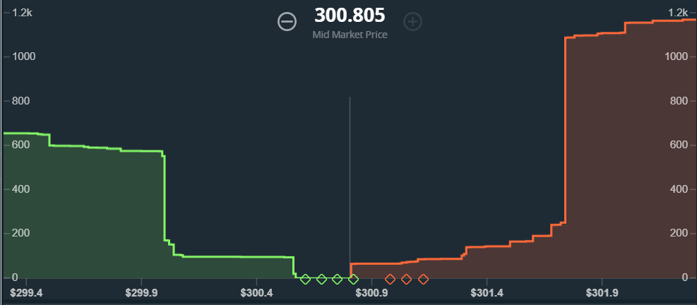
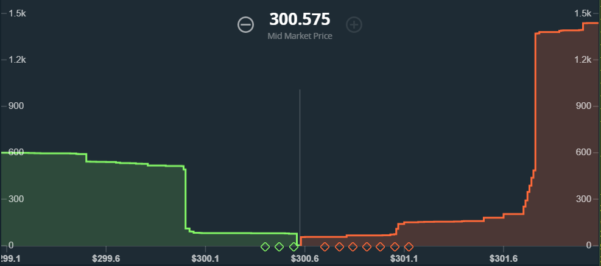

# gdax-multipong
This is a tradebot for BTC, ETH and LTC written in NodeJS for GDAX.  It is designed for flat or oscillating markets.

You will need
*  GDAX API key ([official instructions for creating](https://support.gdax.com/customer/en/portal/articles/2425383-how-can-i-create-an-api-key-for-gdax-)) with **trade** and **view** permissions
*  NodeJS v7.8 or greater (if you're not managing your node installs using [nvm](https://github.com/creationix/nvm) you're missing out!)

## Setup
1.  `clone git@github.com:msolters/gdax-multipong && cd gdax-multipong`
1.  `npm install`
1.  Put your GDAX API `passphrase`, `key`, and `secret` into `credentials.json`
1.  Set your currency and bucket parameters in `settings.json` (more on configuration below)
1.  `node multipong.js`

To begin buying and selling, press the "b" and "s" keys.

## Commands
*  `r` - Reload and apply `settings.json`
*  `b` - Toggle buying on and off
*  `s` - Toggle selling on and off
*  `c` - Cancel all pending buys.  Note, if buying is "on", these orders will be almost instantly-replaced.  Turn off buying before canceling any orders!
*  `q`, `ESC`, or `CTRL+C` - Exit Multipong

## Strategy
Multipong uses a bucket strategy to perform high-frequency range trading between a minimum and maximum currency price in many smaller sub-ranges.

Here's an example with Ethereum.  In this example, buckets are a little less than $0.10USD wide.  Multipong will place a few buy orders, always less than the current mid-market price.  Each buy order is one bucket-width apart.  As soon as one of these buy orders is filled, Multipong will automatically place a sell order one bucket-width higher.  Thus every filled buy will yield exactly one sell, and always at a profit:



As the price of Ethereum falls, more buy orders are placed and filled.  As the price bounces back up, the sell orders are filled, yielding a profit; and the buys are then re-placed.



As the price of a cryptocurrency oscillates throughout the day, many small profitable buy/sell pairs will be executed.  Especially for oscillating markets, this can produce hundreds or thousands of trades a day, all of them favorable.

Each trade will be `trade_size` big; in the images above, the `trade_size` was 0.1ETH.  Clearly, deeper trade sizes will yield more profit per trade, but will drain your fiat capital faster as each trade is more expensive.

Wider buckets can yield a larger profit per trade as well, as the buy-sell spread is larger, but, the price would have to vary much more to make each trade happen, and are only good for more volatile market conditions.  This approach can also be useful if the price is varying a great deal during the day, and you don't want to spend all your fiat in a small price range.

The bucket strategy is helpful in case the currency price falls after buying some crypto.  Say the price of BTC is 5995USD and we buy 0.01BTC; while we wait for the price to hit 6000USD and make a sale, what if the price falls again?  Since each bucket can only buy once, we are guaranteed to still have buckets at *lower* prices that will continue to trade, making money, while our earlier gamble is waiting to be realized.  This allows us to keep making money across a wide price range instead of putting all our eggs into one basket.

Multipong performs best with thin (price width), deep (trade size) buckets, and works best in mostly-flat or oscillating markets.  Note, you may win or lose.  Multipong is provided "as-is," with no guarantees or promises!  Multipong should never place an unfavorable trade, but it could place a favorable trade that never happens.  As with all things crypto, be safe!

## Configuration
Here's an example `settings.json`:
```json
{
  "tz": "America/New_York",
  "multipong": {
    "coin": "BTC",
    "fiat": "USD",
    "initial_cash": 100,
    "greedy": true,
    "num_buckets": 10,
    "trade_size": 0.01,
    "min_price": 7000,
    "max_price": 7400,
    "bucket_runway": 3,
    "midmarket_price_period": 1,
    "trade_period": 50
  }
}
```

*  Multipong will trade between `fiat` currency for `coin`; in this example, it will buy and sell BTC with USD.  Available options are only what GDAX provides: BTC, ETH, LTC, USD, GBP, EUR.
*  `trade_size` is the quantity of `coin` that the bot will buy or sell per bucket.  Keep in mind GDAX's minimums: 0.01 for BTC.
*  Buy and sell BTC if it's between `min_price` and `max_price` (+/- 0.01 [fiat]).  In other words, trading will stop if the price goes above `max_price` or below `min_price`.
*  `num_buckets` is how many trade ranges the total min-max price range will be subdivided into.  A higher number here means more frequent trades, but less profitable ones.  (It also increases liability for fees if the market has sudden shifts.)  If buckets are only a few cents or dollars, a quickly moving price might move faster than trades can be requested (esp. depending on your internet connection) and some orders might end up being *taker* orders!
*  `bucket_runway` is how many buy orders to the left of the midmarket price the app will maintain at any given time.  A value of 3 means that, at most, 3 buy orders will be placed at any given time.  If the price moves up, the lowest buy order is deleted and a new, higher one is placed.  This is *not* true as the price falls (or else how would buys be filled?)
*  `initial_cash` is the amount of cash you are telling Multipong is in your fiat wallet to use.
*  `greedy` determines whether or not `initial_cash` will be treated as your *total* fiat capital.  If `greedy: true`, Multipong will make buys as long as your fiat wallet has enough funds, even if those funds are more than `initial_cash`.  Conversely, if `greedy: false`, Multipong will stop placing buys when it has exhausted `initial_cash`, even if there are more funds in your fiat wallet.
*  `midmarket_price_period` how many ms between updating the current crypto midmarket price in the app
*  `trade_period` how many ms between placing new trades

You are encouraged to explore various permutations of `min_price`, `max_price`, `trade_size` and `num_buckets`.  To avoid getting stuck out with high buys during large runs, we advise you to set a `max_price` below the expected maximum for a given trading period.  You want `min_price` and `max_price` to wrap around the range where the price is expected to see the most volume of trading!

## Updating Buckets/Resetting
As the market moves, you may find you want to adjust your `min_price`, `max_price`, `num_buckets`, etc. without stopping Multipong.  Simply edit your `settings.json` and save the file.  Then, in the app, press the `r` key.  Multipong will re-read the values of `settings.json`, and update the components of the app which require it.

If you are only changing your bucket distribution, ongoing trades will not be touched, but new trades moving forward will respect your new buckets.  However, if you are changing the currency pair that you are trading, Multipong will have to undergo a slightly longer re-initialization process.

Either way, depending on your internet connection, this step should never take longer than a few seconds!  Happy trading!

## Thank You!
This software is provided free for your amusement, edification, and enrichment!  However, if you enjoy multipong, you can show your appreciation by sending a BTC tip to the author here at `1Nhdd9UCsv9dsabLLNRue8ecDN41yrSRdk`

If you have any bugs, try to get a screen capture and/or the contents of your `<coin>-<fiat>.log` file!  (Don't share any sensitive information in your uploads though!)
